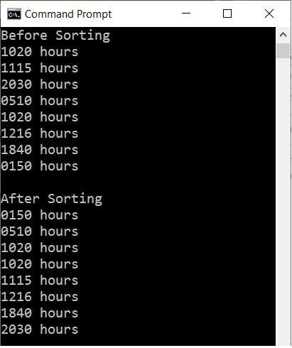

# Cplusplus-File-input-Vectors

This c++ project requires iomanip and vectors classes to extrapulate data from a text file. 

String delimitors are used to in order to separate time stamps.
At the end the output is sorted and converted into 24 HRS format

Here is the result of the output 

